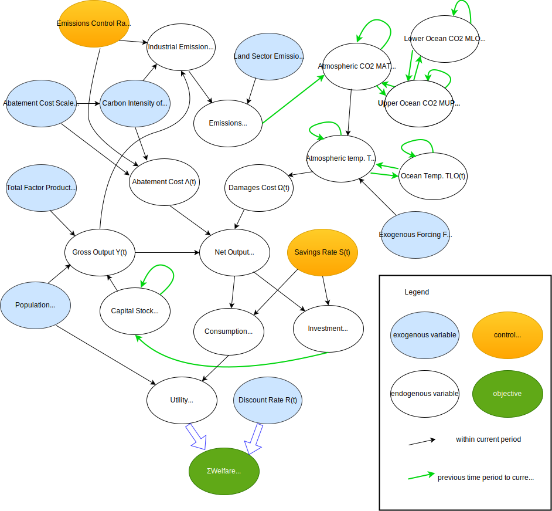
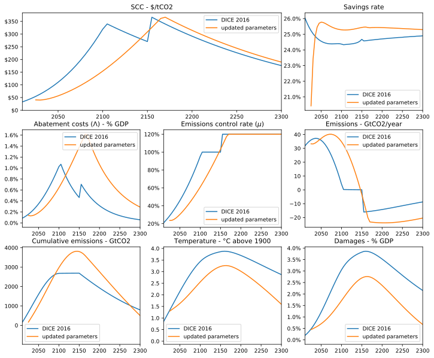
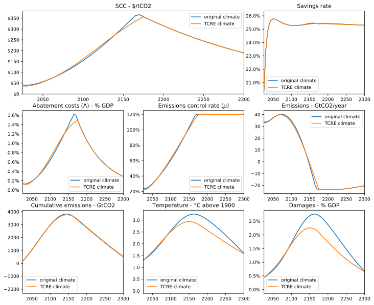

# PythonDICE

A Python implementation of the Dynamic Integrated Climate-Economy (DICE) model. This implementations aims to be as readable and Pythonic as possible, with variable names and functions matching the 2013 User Manual [1] and the model diagram below. As well as the base 2016 version, there are options for alternative parameters, a simplified climate module, and a more flexible damage function.

<p align="center">
    
</p>

## How to run the model

To run the DICE (2016) base model and plot the results:
 
```
from DICE install DICE

# create and run the model
model = DICE()

# plot the results
fig = model.plot_results()
```

Individual parameters can be updated by passing a dictionary:

```
# update the psi_3 parameter to the value suggested by Weitzman (2013)
model2 = DICE(user_parameters = {"psi_3": 0.1644})
```

To plot multiple model runs to compare results, use the ```plot_results()``` method and pass a dictionary of the model runs to compare:

```
from PlotResults import plot_results

comparison_fig = plot_results({model: "DICE 2016", model2: "Weitzman damage function"})
```

## Parameter choices

The default parameters are those from DICE 2016. However, the ```Parameters.py``` file also contains some suggested parameter updates based on the latest climate science and state of the world. These can be used as follows:

```
model = DICE(use_updated_parameters = True)
```

These are the model outputs using the original (DICE 2016) and updated parameters:
<p align="center">
    
</p>

## TCRE Climate Module

Recent climate science has shown that the increase in the global mean temperature is approximately proportional to cumulative carbon dioxide emissions - with the constant of proportionality known as the Transient Climate Response to Cumulative Carbon Emissions, or TCRE [2].

Based on this result, a vastly simplified version of the DICE model is the possible, with atmospheric temperature $T_{AT}$ calculated directly from emissions $E$ by:

$$T_{AT}(t) = T_{AT}(t-1) + \xi E(t-1)$$

where $\xi$ is the TCRE value.

All the other climate variables are not used, resulting in a simpler model structure:
<p align="center">
    
</p>

This alternative implementation of the DICE model can be run by setting the `climate_module` parameter to `TCRE`:

```
TCRE_DICE = DICE(user_parameters = {"climate_module":"TCRE"})
```

The following figures compares model outputs with the original DICE climate module, and using TCRE (both with updated parameters as discussed above). The values track very closely over the next ~100 years while emissions remain high, but then begin to diverge. This is consistent with climate science observations that the proportionality between cumulative emissions and temperature begins to break down as emissions fall [3].

<p align="center">
    
</p>

 
 ## The damage function 

This implementation uses a flexible damage function of the form:

$$D(T_{AT}) = 1 - \frac{1}{1 + \psi_1 T_{AT} + \psi_2 T_{AT}^2 + (\psi_3 T_{AT})^{6.754}}, $$

where $T_{AT}$ is the atmospheric temperature in $\degree C$ above 1900 levels, and $D(T_{AT})$ is in terms of percentage of gross product lost.

The default DICE 2016 parameters set $\psi_1 = 0$ and $\psi_2 = 0.00267$, resulting in a quadratic damage function. Weitzman (2013) has argued damages should increase at a higher rate at higher temperatures. The damage function he suggested can be achieved by setting $\psi_3 = 0.1644$.

<!-- ## Contents 

```Parameters.py``` - This file contains a dataclass Parameters with all the parameter values used for a model run, with default values set at those of DICE 2016. There is also a dictionary `my_updated_parameters` of updated parameters that can be used instead.

```DICE.py``` - The main 

```PlotResults.py```

```run_models.py``` - This runs the models and outputs the figures used in this README. -->


## References

[1] Nordhaus, W., & Sztorc, P. (2013). DICE 2013R - Introduction and User’s Manual. https://williamnordhaus.com/homepage/documents/DICE_Manual_100413r1.pdf (also saved at `references/Nordhaus2013 - DICE 2013R - Introduction and User's Manual` as that link is no longer active)

[2] MacDougall, A. H. (2016). The Transient Response to Cumulative CO2 Emissions: A Review. Current Climate Change Reports, 2(1), 39–47. https://doi.org/10.1007/s40641-015-0030-6

[3] MacDougall, A. H., Friedlingstein, P., & Knutti, R. (2015). The origin and limits of the near proportionality between transient climate warming and cumulative CO2 emissions. 5415.
